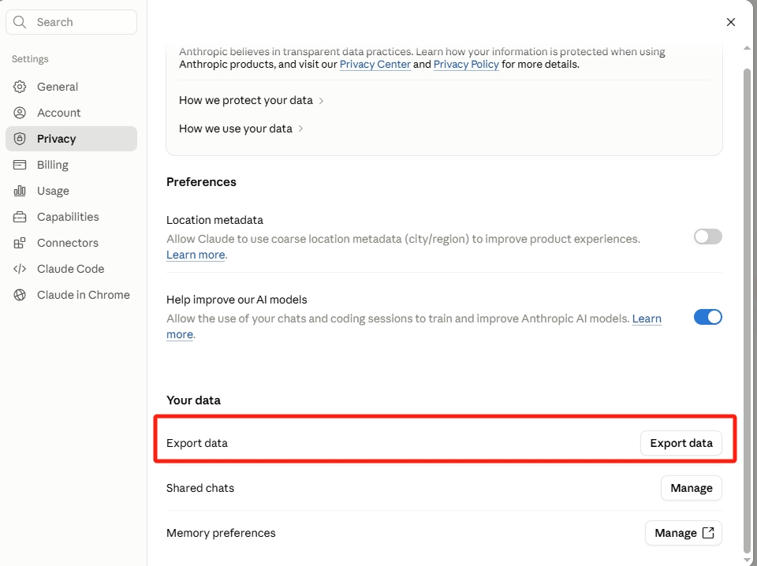
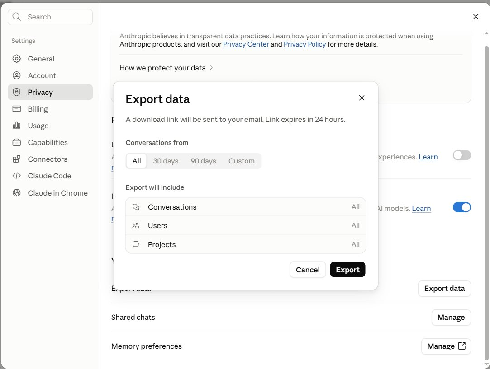
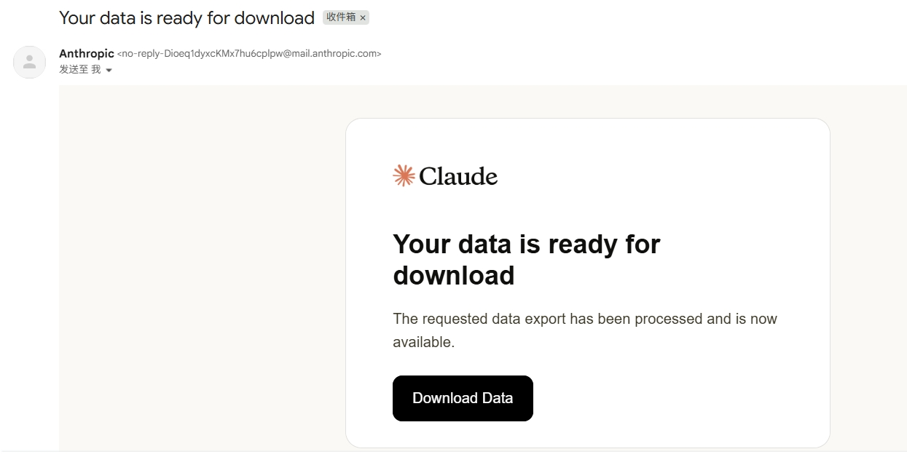

# Claude 数据导出查看器 (Claude Export Viewer)

一个**单文件、纯浏览器、零上传**的工具，用来本地查看你从 Claude.ai 导出的对话数据。

直接用浏览器打开 `claude-export-viewer.html`，选择你导出的 ZIP 包即可阅读全部历史对话，无需安装、无需联网上传你的数据。

## 💡 为什么需要它

**1. 防止账号被封后历史记录全无 —— 记得定期备份。**

Claude.ai 提供了导出全部历史对话的功能。万一账号出问题，本地备份能保住你所有的聊天记录。

**2. 官方导出的 ZIP 没法直接读。**

邮件下载到的是一个 ZIP 压缩包，里面的中文全部被转成了 Unicode 转义编码（形如 `\u4f60\u597d`），人眼无法直接阅读。

**3. 这个查看器帮你把它变成可读的对话界面。**

本项目基于 Claude 开发，是一个本地解析查看器 `claude-export-viewer.html`。双击打开会自动跳转浏览器，选择导出的 ZIP 文件即可正常浏览全部对话。

## 📤 如何导出 Claude 数据

在 Claude.ai 左下角个人账号进入 **Settings（设置）→ Privacy（隐私）→ Export data（导出数据）**，选择要导出的时间范围，点击导出后，到你账号绑定的邮箱里下载即可。

> ⚠️ 邮件里的下载链接 **24 小时后失效**，记得及时下载。建议养成定期备份的习惯。

**第一步**：进入 Privacy 页面，点击右侧 **Export data** 按钮

**第二步**：选择导出的时间范围（All / 30 days / 90 days / Custom）与包含内容，点击 **Export**

**第三步**：到绑定邮箱中收取邮件，点击 **Download Data** 下载 ZIP 压缩包

## 🚀 使用方法

1. 下载本仓库的 `claude-export-viewer.html`（或点击右上角 **Code → Download ZIP**）
2. 用浏览器（Chrome / Edge / Firefox / Safari 均可）双击打开该 HTML 文件
3. 将你的 Claude 导出文件（`.zip` 或 `conversations.json`）拖入页面，或点击选择文件
4. 开始浏览、搜索、导出

## ✨ 功能特性

- 📂 **拖拽即用**：支持导入 Claude 官方导出的 `.zip` 压缩包或 `conversations.json` 文件，自动解码 Unicode 转义内容
- 💬 **对话浏览**：按项目（Projects）和对话（Conversations）分类查看，支持按最近更新、创建时间、消息数排序
- 🔍 **全文搜索**：跨所有对话快速检索关键词
- 🧠 **思考过程**：可展开查看 Claude 的 thinking / reasoning 推理内容
- 🛠️ **工具调用**：渲染 tool_use 工具调用与 artifact 产物
- 📊 **数据统计**：一览导出数据的整体概况
- 🌿 **分支与时间线**：可视化对话的分支结构
- 🖼️ **图片查看**：内置图片浏览，支持上传本地图片对照查看
- 📐 **Mermaid 图表**：自动渲染对话中的 Mermaid 图表
- 📤 **导出**：单条对话可导出为 Markdown，或通过打印另存为 PDF

## 🔒 隐私说明

本工具是**纯前端**实现，所有解析均在你的浏览器本地完成，数据不经过任何服务器，可以完全离线使用。

## 📦 依赖

页面通过 CDN 加载两个第三方库：

- [Mermaid](https://mermaid.js.org/) — 用于渲染图表
- [JSZip](https://stuk.github.io/jszip/) — 用于解析 `.zip` 导出包

> ⚠️ 因为依赖通过 CDN 引入，**首次使用建议保持联网**以加载这两个库。若需完全离线运行，可自行将这两个库下载到本地并修改 HTML 中的 `<script>` 引用路径。

## 🌐 浏览器兼容性

支持现代浏览器（Chrome、Edge、Firefox、Safari 等）。建议使用最新版本以获得最佳体验。

## 🤝 贡献

欢迎提交 Issue 和 Pull Request！

## 📄 许可证

本项目基于 [MIT License](LICENSE) 开源。
